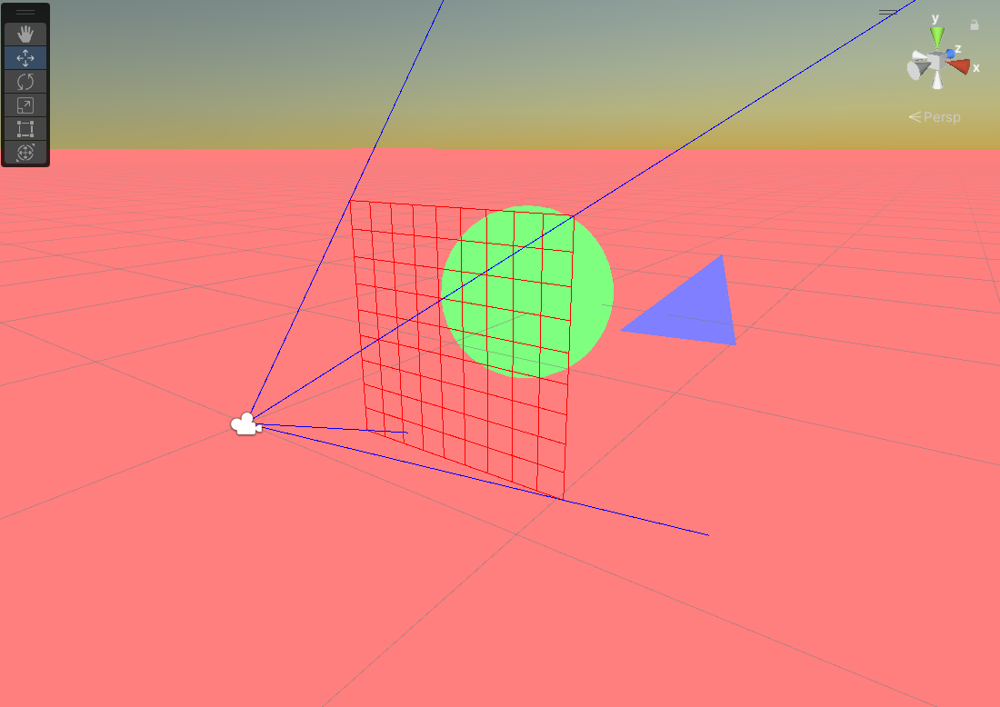
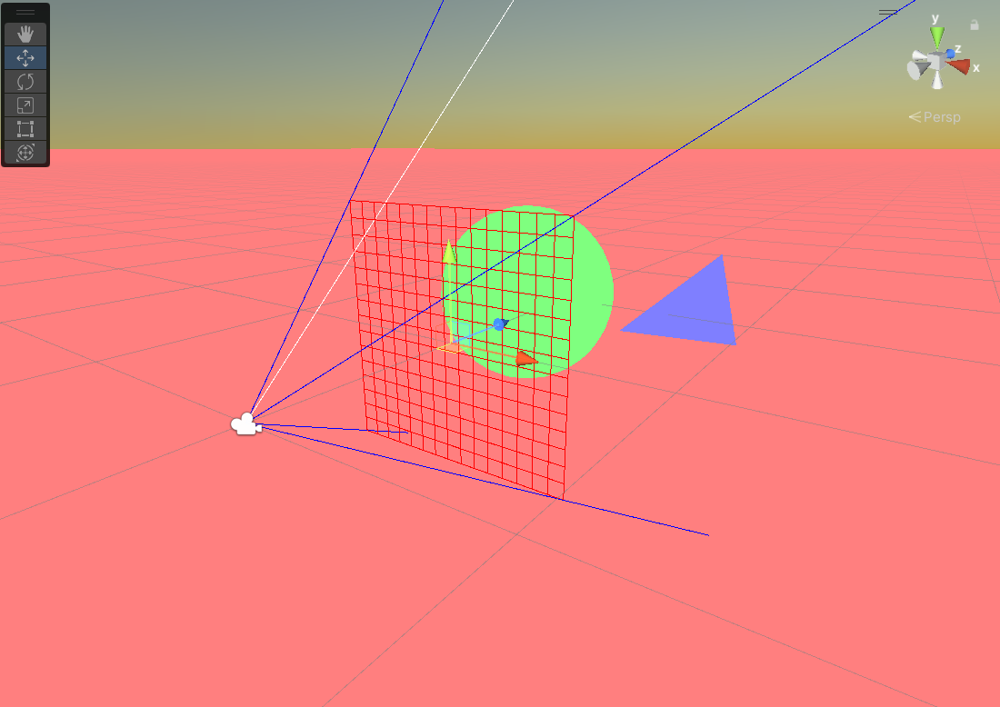
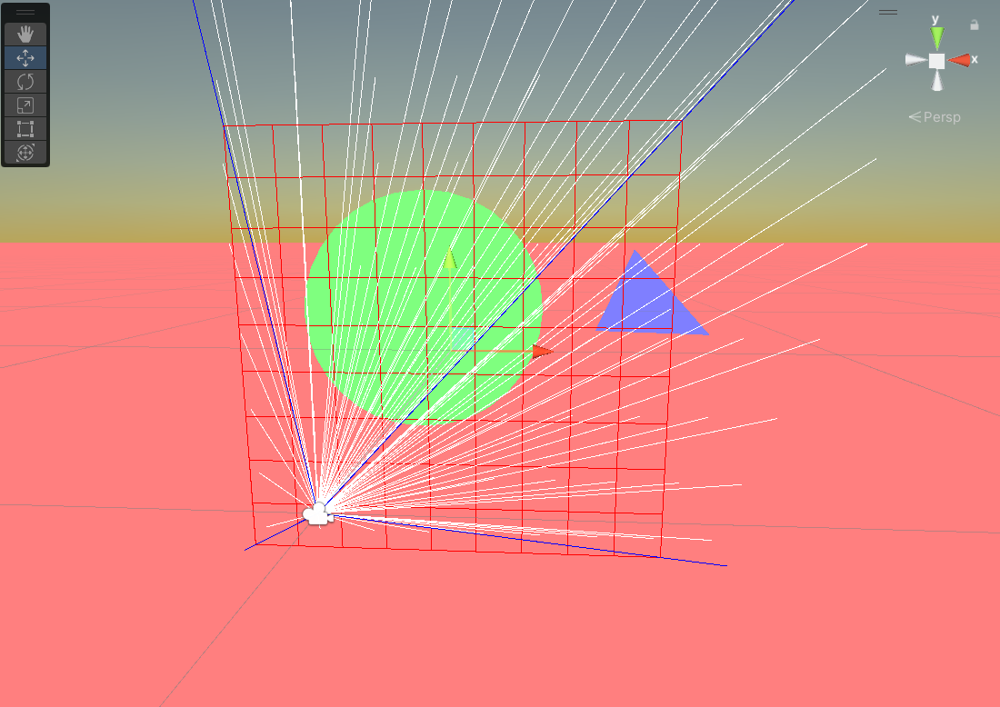
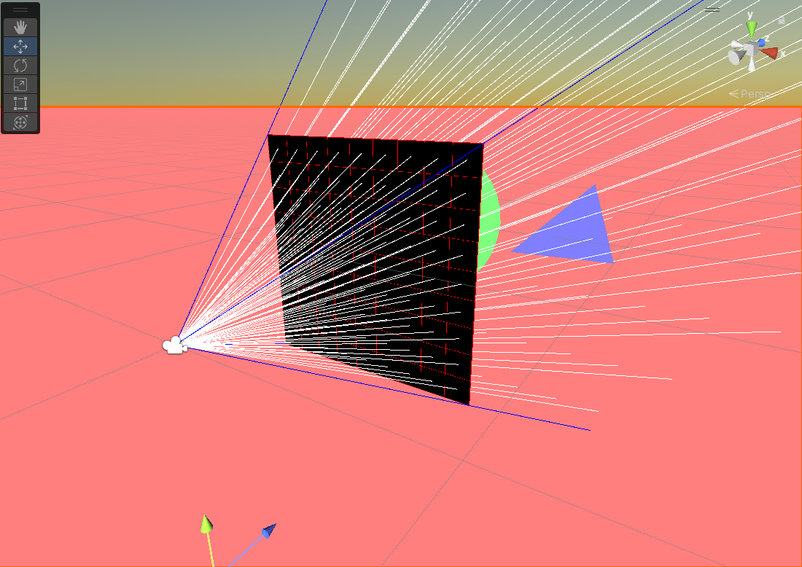
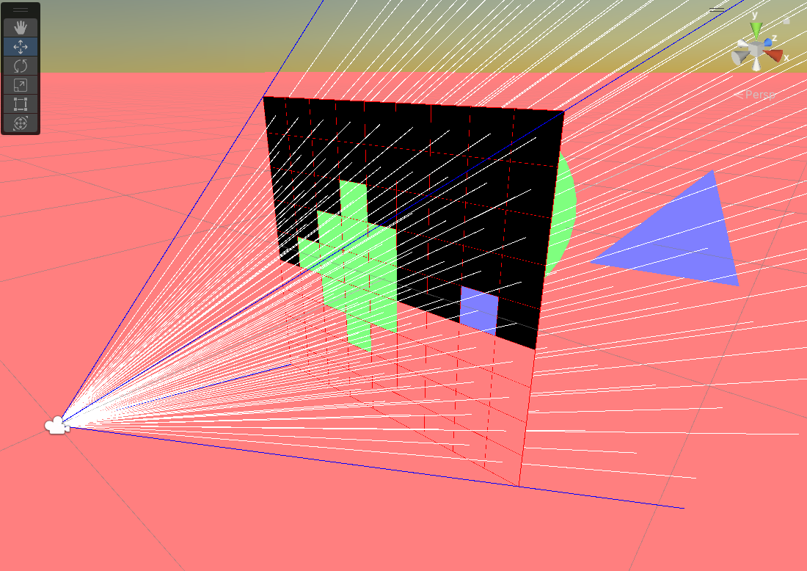

**The University of Melbourne**

# COMP30019 – Graphics and Interaction

## Workshop 3

# Introduction:

In this workshop you will be creating a basic ray tracer simulation _within_ Unity. We have provided you with
a Unity project that is structured in a similar way to the project 1 template code. By
assisting you with the basics required for stage 1 of the project, but in a slightly different context,
we hope that you gain a better understanding of how to approach the project. One of the key difficulties
with starting the project in a "pure C#" environment is that it's hard to visualise what's going on, especially when
battling with bugs related to ray-entity intersections. Here you'll be able to actually draw rays within the Unity
editor to assist with this. In other words, you are creating a "debugger" that could be useful for later
stages of the project too!

> **Note** <br>
> If you are not familiar with what project 1 entails, you might wish to have a quick read of the specification,
> as well as generate your private project template repository. Although you can theoretically complete this workshop
> in isolation from the project, we will be referencing it from time to time to draw your attention
> to important equivalences/differences.

You'll be working with the following assets today:

* **MainScene.unity** - The scene you should open and work with for the entire workshop.
* **Scripts/*.cs** - Files in this folder are Unity "equivalents" of the identically named ones in the project 1 template.

This repository may look rather complex compared to what you saw in previous weeks, but don't 
worry about understanding it all at once. For example, `Scripts/Utils/*` contains scripts that are
used for visualisations of the basic ray tracer primitives in Unity. They aren't the focus of the workshop and
you can safely ignore them for now.

> **Warning** <br>
> Your final submission for project 1 is **not** a Unity project and should have **no Unity dependencies**. 
> The goal of this workshop is to provide you with a sandbox to practice and visualise the techniques required to 
> complete stage 1 of the project (and even later stages), not give you "copy-paste" solutions to it. 

### Tasks

#### 1. Understand the project structure

Open `MainScene.unity` in the editor. Press the ‘Play’ button and you should see what looks like
the output for the first "test scene" provided in project 1. Overlaid on top of this is a red "pixel grid"
representing a very low resolution (9x9) "image" that will eventually be the target of your Unity ray tracer _simulation_.

There are a couple of important things to note here. Firstly, the scene you currently see is *not* ray traced, and simply uses
standard triangle mesh "rasterisation" you already saw last week. In other words, we have created 
an equivalent of the project sample scene in Unity, purely for visualisation and debugging purposes. Secondly, the image pixel
grid has been "embedded" in the world such that it overlays the scene exactly (the ray tracer "camera"
settings match the Unity camera settings).

Switch to the `Scene` tab while the simulation is running, and you can see that the image plane ("pixel grid") 
is exactly one unit in front of the Unity camera. In the object hierarchy, click on each object and inspect the components
attached. In particular, take note of the following components: `Image`, `Scene`, `Plane`, `Triangle`, `Sphere`. These
are Unity component equivalents of classes already provided in the project 1 template.

> **Note** <br>
> As a general convention, we have prefixed **Unity** to the name of objects that are exclusively related to
> Unity visualisations of the scene. Unless instructed otherwise, you may ignore these.

#### 2. Complete the view frustum rays

In the scene view, take note of the blue ray originating from the camera origin, passing through the top-left corner of the 
image plane. This represents one of the four edges of the ray tracer camera [viewing frustum](https://en.wikipedia.org/wiki/Viewing_frustum).
Your first task is to add the other three frustum "debug" rays.

To do this, open `Scene.cs` and look at the `DebugVisualisations()` method where the top-left frustum ray 
has been defined. Use this as the template to create
the other three lines. Note that `Ray` is a Unity class encapsulating a ray data structure for use within the Unity engine. 
Similar to the one defined in the project 1 template, it is constructed using an `origin` vector and `direction` vector. 

<p align="center">
  
</p>

#### 3. Fire a debug ray through the pixel: (1, 1)

Add another line to `DebugVisualisations()` which will define a simulated ray (use `Color.white` for the colour). You should define
it such that it passes through the __middle__ of the top-left pixel in the image plane. You may need
to access the image pixel dimensions here, e.g. `this.image.Width` and `this.image.Height`.

You should ensure that your implementation works without modification no matter what the image pixel 
dimensions are. Within the Unity editor interface,
select the **Image** game object and change the width/height fields on the attached `Image` component so that
the width and height are both **15**. Re-run the simulation and verify the ray still fires through the pixel
coordinate (1, 1). 

<p align="center">
  
</p>

Try a few other image dimensions also, including non-square ones. Change the image pixel
dimensions back to 9x9 when you have finished testing your solution.
to ensure consistency with this guide going forward.

> **Note** <br>
> Here we are assuming a _vertical_ field-of-view (FOV) of 60 degrees, which maintains proper
> frustum alignment with the default Unity camera. This will be evident
> if you try out non-square image pixel dimensions. The
> image plane will always span the Unity camera frustum in the vertical axis, and thus, the
> width has to adjusted to maintain the aspect ratio. See the `ComputeWorldImageBounds()` function
> for the actual computation used.

#### 4. Fire a debug ray through every pixel

Now you should generalise your approach to the previous question and output a ray for every pixel in
the image. For a 9x9 image this means there will be 81 rays! You should obviously _not_ define them
as individual lines of code. Instead, write two nested `for`-loops bounded by the image width and height.
It might be a good idea to write a function that generates ray for a given pixel coordinate,
or similar, if you want to keep your solution organised. While this is currently just for visualisation
purposes, the same logic will be used later to actually do ray tracing.

<p align="center">
  
</p>

Before continuing, navigate around the scene and observe which rays are intersecting with the
sphere/triangle/plane. Think about how the corresponding pixels should be "coloured". Again,
it might be easier to scale the image down (e.g. 4x4) temporarily to visualise this without
so much clutter.

#### 5. Make the image black

Inside the `Render()` method, which is currently empty, set the colour of all
image pixels to be `Color.black`. You may use the `this.image.SetPixel(...)` method to do this.
Use nested `for`-loops like in the previous exercise, and once again,
ensure that your approach generalises for all image pixel dimensions.

<p align="center">
  
</p>

#### 6. Let's ray trace! 

Now you are ready to do some _actual_ ray tracing. Remember, the rays you "see" are just visualisations
within the "rasterised" Unity scene. We need to test for actual intersections with objects in the 
scene to colour the corresponding pixels correctly.  

In the previous step, you set each pixel to `Color.black`. This is good as a fallback in cases
where this is no intersection with an object. However, after doing this, you should fire a ray
corresponding to that pixel and check if any `Triangle`/`Plane`/`Sphere` intersection(s) exist.
This might sound tedious at first, but observe an important detail about the structure
of the project (mirrored in the project 1 template also): All three basic primitives
have a parent class called `SceneEntity`. This also inherits from `MonoBehaviour` 
so can be treated as a regular Unity component. That means you can loop through all 
primitives in the scene,
irrespective of the underlying child component type, using the following code:

```C#
foreach (var sceneEntity in FindObjectsOfType<SceneEntity>())
{
    // Note: sceneEntity could actually be a Triangle OR Plane OR Sphere.
    // But does it matter for the purposes of this exercise?
}
```

From a Unity coding perspective this is a bit of a leap from what you've seen thus far. Don't
worry, we'll delve into this topic more in future weeks. For now, it's more important to
understand the interface to the parent class that is required to write the ray tracer.
Open `SceneEntity.cs` and take note of the two `public` methods: `Intersect()` and `Color()`.
Note that `Intersect()` currently uses the Unity engine to automatically compute ray-entity
intersections. Your task is to figure out how to use these to colour the pixels correctly.

> **Note** <br>
> Unity ships with a powerful collision (physics) engine, which may be tapped into by using
> built-in `*Collider` components. Again, this is a topic that will be explored in future weeks.
> In today's class it's simply a great tool to get some outputs fast! We've already taken
> care of the gory details on the Unity side of things, and the `Intersect()` method will work out of the box.

<p align="center">
  
</p>

At this point you might want to ray trace some higher resolution images -- a single pixel
for the triangle isn't exactly detailed! If you do this, it might be worth removing the 
code for the debug rays, and even disabling the pixel grid object in the scene, as these
might clutter the output too much (or even unnecessarily slow your PC).

#### 7. Override the Unity ray-entity collision logic (extension)

At the moment the Unity engine is used to compute ray-entity intersections. Open each of
the `Plane.cs`, `Triangle.cs` and `Sphere.cs` files and note the overriden `Intersect()`
method in each. Currently this method simply calls the `base` (parent) class
implementation. Your final task is to **write your own** `Intersect()` method for each primitive, such that it
overrides the base class implementation. Start with the plane,
as this is likely to be the most straightforward mathematically. 

You can think of these
methods like "debuggers" for your ray-entity intersection code. If you can write your
own intersection logic that _successfully_ overrides Unity's here, it should also be transferable
to your project with some minor modification, and you can be more confident your general approach is correct. 

> **Note** <br>
> If you do end up porting some of the logic to your project, keep in mind that certain
> Unity classes like `Vector3`, `Ray` and `RaycastHit` have "equivalents" in the project
> template code. There are some differences in the interfaces, and even the numerical
> precision (`floats` are used in Unity, but we use `doubles` in the project).

At this point we'll leave things to you. Feel free to personally extend this workshop to assist 
with the testing and/or debugging of your project solution. Be careful not to share this 
with other students though -- use a **private** repository if you fork this one! 

Finally, it's important to remember we aren't giving you "copy-paste" solutions 
to the project here, although you might find it does come close
in some select cases. You may use this as a tool, among _other_ resources (the most important 
being the specification), to assist with completing the project.

Good luck!
